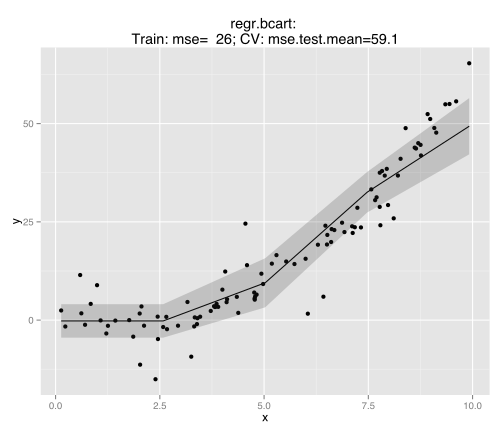
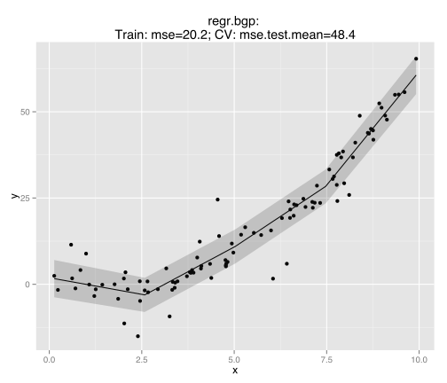
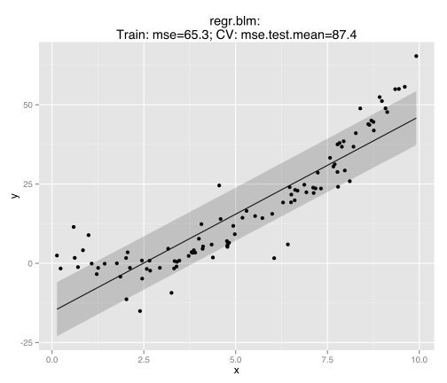
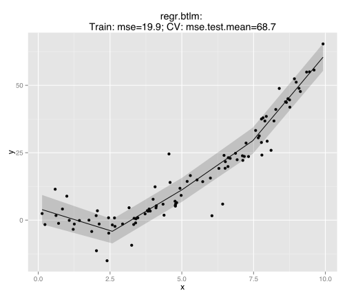
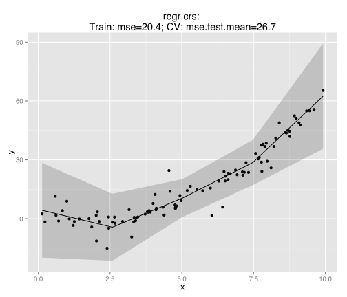

Let's try out a little toy example to see how all the regression methods integrated in **mlr** behave on a schoolbook example.
Luckily this can be done with just a few lines of code - but let's narrow it done to those which support uncertainty estimation.

Let's generate a list with all mlr-learners fitting the criteria.


#library(mlr)
devtools::load_all("~/gits/mlr/")
learners = listLearners("regr", properties = "se", create = TRUE)


Let's generate some easy data:


set.seed(1)
n = 100
x = runif(n, min = 0, max = 10)
y = rnorm(n, mean = (x-2)^2, sd = seq(1, 3, length.out = n)^2)
toy.task = makeRegrTask(id = "toy", data = data.frame(x,y), target = "y")


Now we can already create all the graphs:


for(lrn in learners) {
  print(plotLearnerPrediction(lrn, toy.task, gridsize = 5))
}


       


## Error in chol.default(R): der führende Minor der Ordnung 95 ist nicht positiv definit


 

Hu? It looks like we shamelessly copied the code from the last blog-post.
How easy!
