This time we want to explore how the uncertainty estimation of random forests behaves under different settings.

<!--more-->

Create the learner:


library(mlr)
rf.learner = makeLearner("regr.randomForest", predict.type = "se", keep.inbag = TRUE)


In our toy example we cut some data to see how the interpolation and the uncertainty behaves in that gaps.


set.seed(123)
f = function(x) sin(x)*x
n = 50
x = runif(n, 0, 13)
y = f(x) + rnorm(n, sd = 0.5)
x = x[y>-3]; y = y[y>-3]
plot(y~x)
x.r = seq(min(x),max(x),length.out = 100)
lines(x.r, f(x.r))


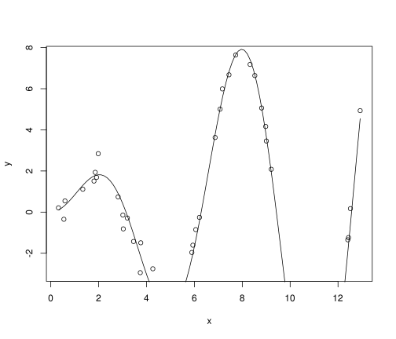 


toy.task = makeRegrTask(id = "toy", data = data.frame(x,y), target = "y")


With a little help of the *ParamHelpers* Package we can easily generate an exhaustive set of different settings:


ps = makeParamSet(
  makeDiscreteParam("se.method", values = c("bootstrap", "jackknife", "noisy.bootstrap")),
  makeDiscreteParam("nr.of.bootstrap.samples", values = c(10,100)),
  makeDiscreteParam("ntree", values = c(500, 1000)),
  makeDiscreteParam("ntree.for.se", values = c(50, 500), requires = quote(se.method == "noisy.bootstrap"))
  )
design = generateGridDesign(par.set = ps, resolution = 1, trafo = TRUE) 
design = design[is.na(design$ntree.for.se) | as.integer(as.character((design$ntree.for.se))) < as.integer(as.character((design$ntree))),]
para.settings = dfRowsToList(design, par.set = ps)

Now we can iterate over all different parameter settings and see how it turns out.


for(par.setting in para.settings) {
  lrn = setHyperPars(rf.learner, par.vals = removeMissingValues(par.setting))
  print(plotLearnerPrediction(lrn, toy.task, cv = 0))
}


  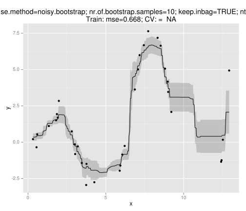 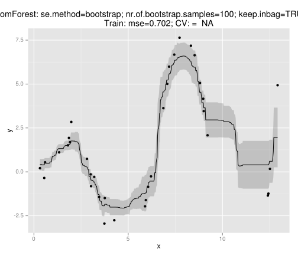  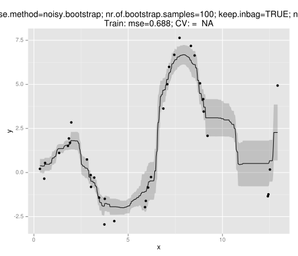 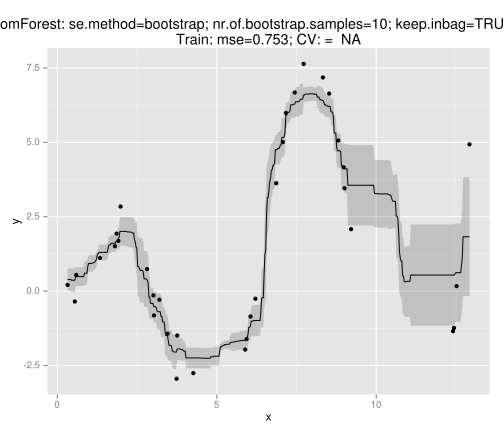 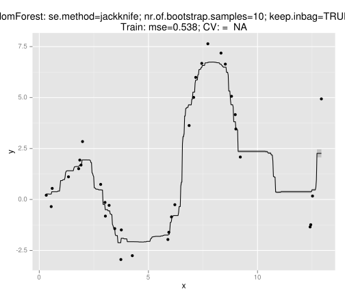 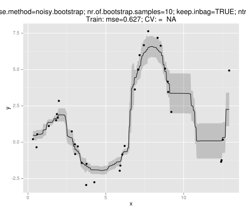 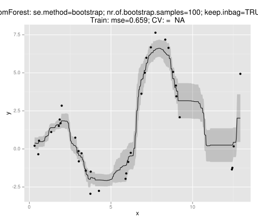  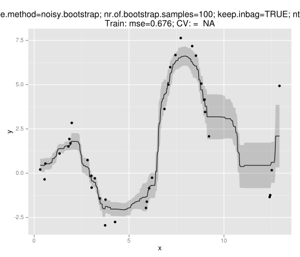 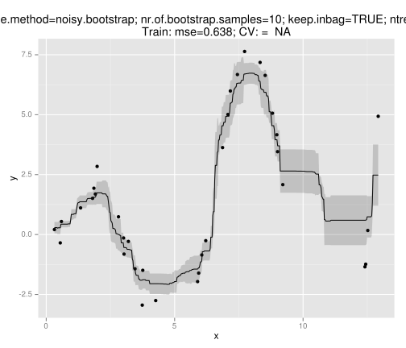 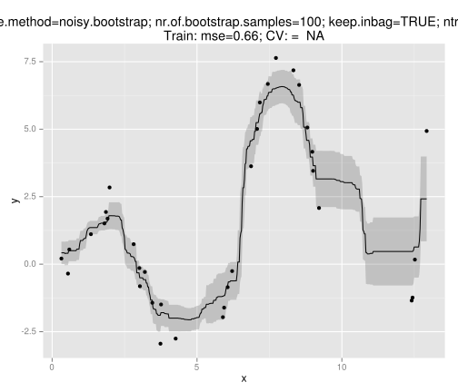 
That all doesn't look so reliable to me.
