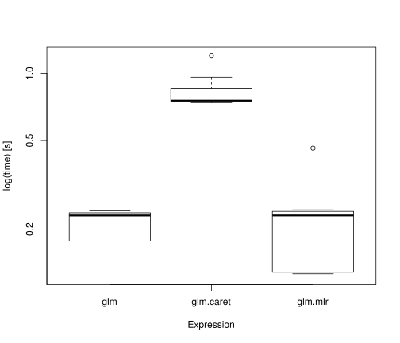

In [a recent blogpost](http://freakonometrics.hypotheses.org/20345) Arthur from freakonometrics had a closer look into the computational times of different classification methods.
Interestingly he found out that that *caret* was way slower than calling the method directly in *R*.
It was pointed out in the comments that caret automatically does some kind of resampling and tuning and this makes it obviously slower.
So we have to keep in mind that for *caret* `train` always means parameter tuning as well - although it is not always clear which parameters and regions are taken into account.
For our comparison we will keep it fair and torn it off but still we got curious if *mlr* generates an computational overhead.

<!--more-->

Let's prepare the big data set accordingly to the original posts in freakonometrics. 
The big one with 710000 observations would need to much memory to store all the models in our little benchmark.
That's why we settle for 7100 and some more repititions.


myocarde = read.table("http://freakonometrics.free.fr/myocarde.csv", head=TRUE, sep=";")
levels(myocarde$PRONO) = c("Death","Survival")
idx = rep(1:nrow(myocarde), each=100)
TPS = matrix(NA,30,10)
myocarde_large = myocarde[idx,]
k = 23
M = data.frame(matrix(rnorm(k*nrow(myocarde_large)), nrow(myocarde_large), k))
names(M) = paste("X", 1:k, sep="")
myocarde_large = cbind(myocarde_large,M)
dim(myocarde_large)



## [1] 7100   31


We will benchmark the calls using the small and practical package *microbenchmark*.
So first we define only the calls we want to benchmark.
For fairness we always set the glm model parameter to FALSE so that the model data.frame is not included redundantly.


library(randomForest)
glm.call = quote({glm.fit = glm(PRONO~., data=myocarde_large, family="binomial", model = FALSE)})
rf.call = quote({set.seed(1); rf.fit = randomForest(PRONO~., data=myocarde_large, ntree=500)})


For *caret* we turn off any special training method to get as close as possible to what the original `glm` does.
Same for the *randomForest*. 
Although we had some difficulties finding out how to train the *randomForest* in the default way. 


library(caret)
glm.caret.call = quote({
  glm.caret.fit = caret::train(
    PRONO~., 
    data = myocarde_large, 
    method="glm", 
    model = FALSE,
    trControl = trainControl(method = "none"))
  })
rf.caret.call = quote({
  set.seed(1)
  rf.caret.fit = caret::train(
    PRONO~.,
    data = myocarde_large,
    method = "rf",
    ntree = 500,
    trControl = trainControl(method = "none"),
    tuneGrid = data.frame(mtry = floor(sqrt(ncol(myocarde_large)-1))))
  })


Finally we define the call for *mlr*. 


library(mlr)
lrn.glm = makeLearner("classif.binomial")
lrn.rf = makeLearner("classif.randomForest", ntree = 500)
tsk = makeClassifTask(id = "myocarde", data = myocarde_large, target = "PRONO")
glm.mlr.call = quote({glm.mlr.fit = train(learner = lrn.glm, task = tsk)})
rf.mlr.call = quote({set.seed(1); rf.mlr.fit = train(learner = lrn.rf, task = tsk)})  


Now, using *microbenchmark* we can compare the runtimes of each call.
Notice that the benchmark does two warm up iterations per default wich will not be taken into account for the comparison.


library("microbenchmark")
mb.res = microbenchmark(
  glm = eval(glm.call), glm.caret = eval(glm.caret.call), glm.mlr = eval(glm.mlr.call),
  rf = eval(rf.call), rf.caret = eval(rf.caret.call), rf.mlr = eval(rf.mlr.call),
  times = 50)
boxplot(mb.res)


 

We are happy that *mlr* doesn't bring you too much computational overhead.
Strangely *caret* still is a fair amount slower.
It's not clear to us what happens here but one reason might also be that the `caret.fit` object contains also the complete training data.

Let's have a look if we did get the same model for *glm* with each call? 


all.equal(glm.caret.fit$finalModel$coefficients, glm.fit$coefficients)



## [1] TRUE



all.equal(glm.mlr.fit$learner.model$coefficients, glm.fit$coefficients)



## [1] TRUE



all.equal(rf.caret.fit$finalModel$votes, rf.fit$votes)



## [1] "Mean relative difference: 0.01422764"



all.equal(rf.mlr.fit$learner.model$votes, rf.fit$votes)



## [1] TRUE


We were not able to let caret run exactly as the *randomForest* although all important parameters seem to be the same when we run `Map(all.equal, rf.caret.fit$finalModel, rf.fit)`. 

The object sizes:


fits = list(glm = glm.fit, glm.caret = glm.caret.fit, glm.mlr = glm.mlr.fit,
            rf = rf.fit, rf.caret = rf.caret.fit, rf.mlr = rf.mlr.fit)
sapply(fits, function(x) format(object.size(x), units = "KB"))



##         glm   glm.caret     glm.mlr          rf    rf.caret      rf.mlr 
## "7066.3 Kb" "9334.9 Kb" "7108.9 Kb"   "6080 Kb" "8187.2 Kb" "6146.1 Kb"


Maybe a reason for *caret*s inferior runtime is the fact that it stores more information in its model objects.
