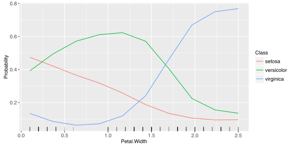
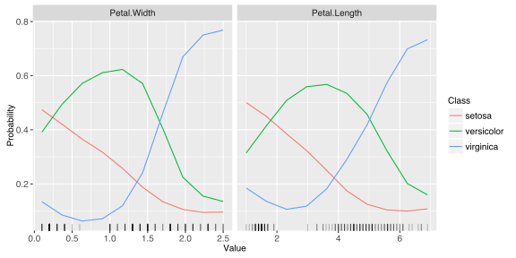
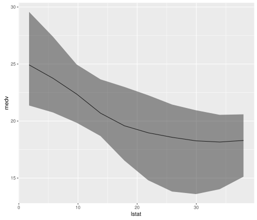
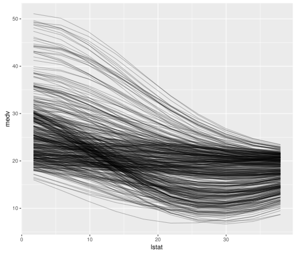
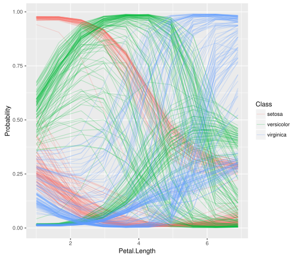
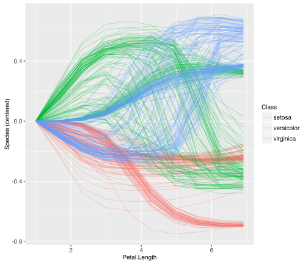
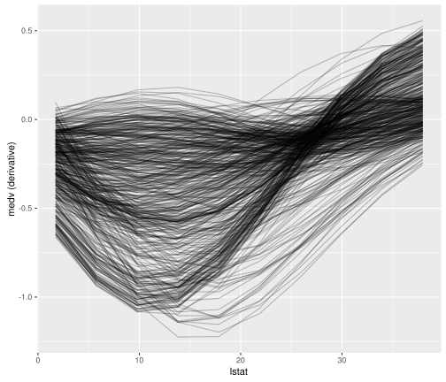
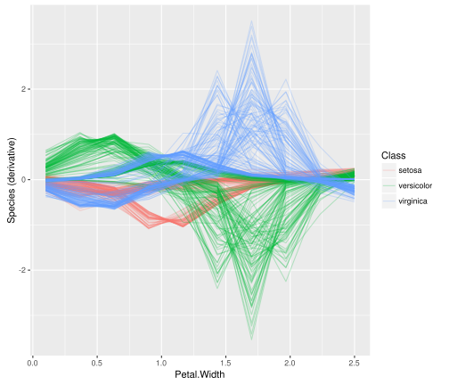
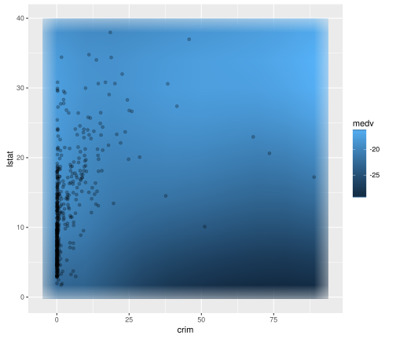

Learners use features to make predictions but how those features are used is often not apparent.
[mlr](http://github.com/mlr-org/mlr) can estimate the dependence of a learned function on a subset of the feature space using
`generatePartialDependenceData`.

<!--more-->

Partial dependence plots reduce the potentially high dimensional function estimated by the learner, and display a marginalized version of this function in a lower dimensional space. For example suppose $\mathbb{E}[Y \ \| \ X = x] = f(x)$. With $(x, y)$ pairs drawn independently, a learner may estimate $\hat{f}$, which, if $X$ is high dimensional can be uninterpretable. Suppose we want to approximate the relationship between some column-wise subset of $X$. We partition $X$ into two sets, $X_s$ and $X_c$ such that $X = X_s \cup X_c$, where $X_s$ is a subset of $X$ of interest.

The partial dependence of $f$ on $X_c$ is

$$f_{X_s} = \mathbb{E}_{X_c}f(X_s, X_c).$$

We can use the following estimator:

$$\hat{f}_{x_s} = \frac{1}{N} \sum_{i = 1}^N \hat{f}(x_s, x_{ic}).$$

This is described by [Friedman (2001)](https://projecteuclid.org/euclid.aos/1013203451) and in [Hastie, Tibsharani, and Friedman (2009)](http://statweb.stanford.edu/~tibs/ElemStatLearn/).

The individual conditional expectation of an observation can also be estimated using the above algorithm absent the averaging, giving $\hat{f}^{(i)}_{x_s}$ as described in [Goldstein, Kapelner, Bleich, and Pitkin (2014)](https://arxiv.org/abs/1309.6392). This allows the discovery of features of $\hat{f}$ that may be obscured by an aggregated summary of $\hat{f}$.

The partial derivative of the partial dependence function, $\frac{\partial \hat{f}_{x_s}}{\partial x_s}$, and the individual conditional expectation function, $\frac{\partial \hat{f}^{(i)}_{x_s}}{\partial x_s}$, can also be computed. For regression and survival tasks the partial derivative of a single feature $x_s$ is the gradient of the partial dependence function, and for classification tasks where the learner can output class probabilities the Jacobian. Note that if the learner produces discontinuous partial dependence (e.g., piecewise constant functions such as decision trees, ensembles of decision trees, etc.) the derivative will be 0 (where the function is not changing) or trending towards positive or negative infinity (at the discontinuities where the derivative is undefined). Plotting the partial dependence function of such learners may give the impression that the function is not discontinuous because the prediction grid is not composed of all discontinuous points in the predictor space. This results in a line interpolating that makes the function appear to be piecewise linear (where the derivative would be defined except at the boundaries of each piece).

The partial derivative can be informative regarding the additivity of the learned function in certain features. If $\hat{f}^{(i)}_{x_s}$ is an additive function in a feature $x_s$, then its partial derivative will not depend on any other features ($x_c$) that may have been used by the learner. Variation in the estimated partial derivative indicates that there is a region of interaction between $x_s$ and $x_c$ in $\hat{f}$. Similarly, instead of using the mean to estimate the expected value of the function at different values of $x_s$, instead computing the variance can highlight regions of interaction between $x_s$ and $x_c$.

Again, see [Goldstein, Kapelner, Bleich, and Pitkin (2014)](http://arxiv.org/abs/1309.6392) for more details and their package [ICEbox](https://cran.r-project.org/web/packages/ICEbox/index.html) for the original implementation. The algorithm works for any supervised learner with classification, regression, and survival tasks.

## Partial Dependence

Our implementation, following [mlr](http://github.com/mlr-org/mlr)'s [visualization](http://mlr-org.github.io/mlr-tutorial/devel/html/visualization/index.html) pattern, consists
of the above mentioned function `generatePartialDependenceData` and `plotPartialDependence`. The former generates input (objects of class `PartialDependenceData`) for the latter.

The first step executed by `generatePartialDependenceData` is to generate a feature grid for every element of the character vector `features` passed. The data are given by the `input` argument, which can be a `Task` or a `data.frame`. The feature grid can be generated in several ways. A uniformly spaced grid of length `gridsize` (default 10) from the empirical minimum to the empirical maximum is created by default, but arguments `fmin` and `fmax` may be used to override the empirical default (the lengths of `fmin` and `fmax` must match the length of `features`). Alternatively the feature data can be resampled, either by using a bootstrap or by subsampling.

Results from `generatePartialDependenceData` can be visualized with `plotPartialDependence`.


library(mlr)



## Loading required package: ParamHelpers



lrn.classif = makeLearner("classif.ksvm", predict.type = "prob")
fit.classif = train(lrn.classif, iris.task)
pd = generatePartialDependenceData(fit.classif, iris.task, "Petal.Width")
pd



## PartialDependenceData
## Task: iris-example
## Features: Petal.Width
## Target: setosa, versicolor, virginica
## Derivative: FALSE
## Interaction: FALSE
## Individual: FALSE
##    Class Probability Petal.Width
## 1 setosa   0.5009893   0.1000000
## 2 setosa   0.4525148   0.3666667
## 3 setosa   0.3873360   0.6333333
## 4 setosa   0.3253844   0.9000000
## 5 setosa   0.2528760   1.1666667
## 6 setosa   0.1789784   1.4333333
## ... (30 rows, 3 cols)



plotPartialDependence(pd, data = iris)


As noted above, $x_s$ does not have to be unidimensional. If it is not, the `interaction` flag must be set to `TRUE`. Then the individual feature grids are combined using the Cartesian product, and the estimator above is applied, producing the partial dependence for every combination of unique feature values. If the `interaction` flag is `FALSE` (the default) then by default $x_s$ is assumed unidimensional, and partial dependencies are generated for each feature separately. The resulting output when `interaction = FALSE` has a column for each feature, and `NA` where the feature was not used. With one feature and a regression task the output is a line plot, with a point for each point in the corresponding feature's grid. For classification tasks there is a line for each class (except for binary classification tasks, where the negative class is automatically dropped). The `data` argument to `plotPartialPrediction` allows the training data to be input to show the empirical marginal distribution of the data.


pd.lst = generatePartialDependenceData(fit.classif, iris.task, c("Petal.Width", "Petal.Length"))
head(pd.lst$data)



##    Class Probability Petal.Width Petal.Length
## 1 setosa   0.5009893   0.1000000           NA
## 2 setosa   0.4525148   0.3666667           NA
## 3 setosa   0.3873360   0.6333333           NA
## 4 setosa   0.3253844   0.9000000           NA
## 5 setosa   0.2528760   1.1666667           NA
## 6 setosa   0.1789784   1.4333333           NA



tail(pd.lst$data)



##        Class Probability Petal.Width Petal.Length
## 55 virginica   0.2100896          NA     3.622222
## 56 virginica   0.3211087          NA     4.277778
## 57 virginica   0.4474281          NA     4.933333
## 58 virginica   0.6038915          NA     5.588889
## 59 virginica   0.7114721          NA     6.244444
## 60 virginica   0.7243988          NA     6.900000



plotPartialDependence(pd.lst, data = iris)



pd.int = generatePartialDependenceData(fit.classif, iris.task, c("Petal.Width", "Petal.Length"), interaction = TRUE)
pd.int



## PartialDependenceData
## Task: iris-example
## Features: Petal.Width, Petal.Length
## Target: setosa, versicolor, virginica
## Derivative: FALSE
## Interaction: TRUE
## Individual: FALSE
##    Class Probability Petal.Width Petal.Length
## 1 setosa   0.6709789   0.1000000            1
## 2 setosa   0.6672190   0.3666667            1
## 3 setosa   0.6326047   0.6333333            1
## 4 setosa   0.5623204   0.9000000            1
## 5 setosa   0.4606393   1.1666667            1
## 6 setosa   0.3623315   1.4333333            1
## ... (300 rows, 4 cols)



plotPartialDependence(pd.int, facet = "Petal.Length")


When `interaction = TRUE`, `plotPartialDependence` can either facet over one feature, showing the conditional relationship between the other feature and $\hat{f}$ in each panel, or a tile plot. The latter is, however, not possible with multiclass classification (an example of a tile plot will be shown later).

At each step in the estimation of $\hat{f}_{x_s}$ a set of predictions of length $N$ is generated. By default the mean prediction is used. For classification where `predict.type = "prob"` this entails the mean class probabilities. However, other summaries of the predictions may be used. For regression and survival tasks the function used here must either return one number or three, and, if the latter, the numbers must be sorted lowest to highest. For classification tasks the function must return a number for each level of the target feature.

As noted, the `fun` argument can be a function which returns three numbers (sorted low to high) for a regression task. This allows further exploration of relative feature importance. If a feature is relatively important, the bounds are necessarily tighter because the feature accounts for more of the variance of the predictions, i.e., it is "used" more by the learner. More directly setting `fun = var` identifies regions of interaction between $x_s$ and $x_c$. This can also be accomplished by computing quantiles. The wider the quantile bounds, the more variation in $\hat{f}$ is due to features other than $x_s$ that is shown in the plot.


lrn.regr = makeLearner("regr.ksvm")
fit.regr = train(lrn.regr, bh.task)

pd.ci = generatePartialDependenceData(fit.regr, bh.task, "lstat",
  fun = function(x) quantile(x, c(.25, .5, .75)))
pd.ci



## PartialDependenceData
## Task: BostonHousing-example
## Features: lstat
## Target: medv
## Derivative: FALSE
## Interaction: FALSE
## Individual: FALSE
##       medv     lstat    lower    upper
## 1 24.89563  1.730000 21.34208 29.53842
## 2 23.75120  5.756667 20.80800 27.41496
## 3 22.35517  9.783333 19.89995 25.02955
## 4 20.68868 13.810000 18.68442 23.66822
## 5 19.60887 17.836667 16.53090 22.95956
## 6 19.01085 21.863333 14.90694 22.15043
## ... (10 rows, 4 cols)



plotPartialDependence(pd.ci)


In addition to bounds based on a summary of the distribution of the conditional expectation of each observation, learners which can estimate the variance of their predictions can also be used. The argument `bounds` is a numeric vector of length two which is added (so the first number should be negative) to the point prediction to produce a confidence interval for the partial dependence. The default is the .025 and .975 quantiles of the Gaussian distribution.


fit.se = train(makeLearner("regr.randomForest", predict.type = "se"), bh.task)
pd.se = generatePartialDependenceData(fit.se, bh.task, c("lstat", "crim"))
head(pd.se$data)



##       medv     lstat crim    lower    upper
## 1 31.37153  1.730000   NA 27.46624 35.27682
## 2 26.10948  5.756667   NA 23.61059 28.60836
## 3 23.50455  9.783333   NA 21.32318 25.68591
## 4 22.16694 13.810000   NA 20.41004 23.92384
## 5 20.47348 17.836667   NA 18.75208 22.19489
## 6 19.81750 21.863333   NA 18.02763 21.60738



tail(pd.se$data)



##        medv lstat     crim    lower    upper
## 15 21.77549    NA 39.54849 19.53901 24.01197
## 16 21.76182    NA 49.43403 19.52371 23.99993
## 17 21.74738    NA 59.31957 19.50215 23.99261
## 18 21.74176    NA 69.20512 19.49160 23.99193
## 19 21.74507    NA 79.09066 19.49845 23.99169
## 20 21.74510    NA 88.97620 19.49845 23.99175



plotPartialDependence(pd.se)


As previously mentioned if the aggregation function is not used, i.e., it is the identity, then the conditional expectation of $\hat{f}^{(i)}_{x_s}$ is estimated. If `individual = TRUE` then `generatePartialDependenceData` returns $N$ partial dependence estimates made at each point in the prediction grid constructed from the features.


pd.ind.regr = generatePartialDependenceData(fit.regr, bh.task, "lstat", individual = TRUE)
pd.ind.regr



## PartialDependenceData
## Task: BostonHousing-example
## Features: lstat
## Target: medv
## Derivative: FALSE
## Interaction: FALSE
## Individual: TRUE
## Predictions centered: FALSE
##       medv     lstat idx
## 1 26.93583  1.730000   1
## 2 25.87909  5.756667   1
## 3 24.65914  9.783333   1
## 4 23.46122 13.810000   1
## 5 22.40207 17.836667   1
## 6 21.52889 21.863333   1
## ... (5060 rows, 3 cols)



plotPartialDependence(pd.ind.regr)


The resulting output, particularly the element `data` in the returned object, has an additional column `idx` which gives the index of the observation to which the row pertains.

For classification tasks this index references both the class and the observation index.


pd.ind.classif = generatePartialDependenceData(fit.classif, iris.task, "Petal.Length", individual = TRUE)
pd.ind.classif



## PartialDependenceData
## Task: iris-example
## Features: Petal.Length
## Target: setosa, versicolor, virginica
## Derivative: FALSE
## Interaction: FALSE
## Individual: TRUE
## Predictions centered: FALSE
##    Class Probability Petal.Length      idx
## 1 setosa   0.9802316            1 1.setosa
## 2 setosa   0.9727328            1 2.setosa
## 3 setosa   0.9805615            1 3.setosa
## 4 setosa   0.9784360            1 4.setosa
## 5 setosa   0.9794669            1 5.setosa
## 6 setosa   0.9740215            1 6.setosa
## ... (4500 rows, 4 cols)



plotPartialDependence(pd.ind.classif)


The plots, at least in these forms, are difficult to interpet. Individual estimates of partial dependence can also be centered by predictions made at all $N$ observations
for a particular point in the prediction grid created by the features. This is controlled by the argument `center` which is a list of the same length as the length of the `features` argument and contains the values of the `features` desired.


pd.ind.classif = generatePartialDependenceData(fit.classif, iris.task, "Petal.Length", individual = TRUE, center = list("Petal.Length" = min(iris$Petal.Length)))
plotPartialDependence(pd.ind.classif)


Partial derivatives can also be computed for individual partial dependence estimates and aggregate partial dependence. This is restricted to a single feature at a time. The derivatives of individual partial dependence estimates can be useful in finding regions of interaction between the feature for which the derivative is estimated and the features excluded. Applied to the aggregated partial dependence function they are not very informative, but when applied to the individual conditional expectations, they can be used to find regions of interaction.


pd.regr.der.ind = generatePartialDependenceData(fit.regr, bh.task, "lstat", derivative = TRUE, individual = TRUE)
head(pd.regr.der.ind$data)



##         medv     lstat idx
## 1 -0.2247414  1.730000   1
## 2 -0.2913475  5.756667   1
## 3 -0.3067001  9.783333   1
## 4 -0.2834698 13.810000   1
## 5 -0.2408035 17.836667   1
## 6 -0.1926000 21.863333   1



plotPartialDependence(pd.regr.der.ind)



pd.classif.der.ind = generatePartialDependenceData(fit.classif, iris.task, "Petal.Width", derivative = TRUE, individual = TRUE)
head(pd.classif.der.ind$data)



##    Class Probability Petal.Width      idx
## 1 setosa  0.02844707         0.1 1.setosa
## 2 setosa  0.02068004         0.1 2.setosa
## 3 setosa  0.01866827         0.1 3.setosa
## 4 setosa  0.01760251         0.1 4.setosa
## 5 setosa  0.02963009         0.1 5.setosa
## 6 setosa  0.04360893         0.1 6.setosa



plotPartialDependence(pd.classif.der.ind)


This suggests that `Petal.Width` interacts with some other feature in the neighborhood of $(1.5, 2)$ for classes "virginica" and "versicolor".

## Functional ANOVA

[Hooker (2004)](http://dl.acm.org/citation.cfm?id=1014122) proposed the decomposition of a learned function $\hat{f}$ as a sum of lower dimensional functions $$f(\mathbf{x}) = g_0 + \sum_{i = 1}^p g_{i}(x_i) + \sum_{i \neq j} g_{ij}(x_{ij}) + \ldots$$ where $p$ is the number of features. [&generateFunctionalANOVAData] estimates the individual $g$ functions using partial dependence. When functions depend only on one feature, they are equivalent to partial dependence, but a $g$ function which depends on more than one feature is the "effect" of only those features: lower dimensional "effects" are removed.

$$\hat{g}_u(x) = \frac{1}{N} \sum_{i = 1}^N \left( \hat{f}(x) - \sum_{v \subset u} g_v(x) \right)$$

Here $u$ is a subset of ${1, \ldots, p}$. When $|v| = 1$ $g_v$ can be directly computed by computing the bivariate partial dependence of $\hat{f}$ on $x_u$ and then subtracting off the univariate partial dependences of the features contained in $v$.

Although this decomposition is generalizable to classification it is currently only available for regression tasks.


lrn.regr = makeLearner("regr.ksvm")
fit.regr = train(lrn.regr, bh.task)

fa = generateFunctionalANOVAData(fit.regr, bh.task, "lstat", depth = 1, fun = median)
fa



## FunctionalANOVAData
## Task: BostonHousing-example
## Features: lstat
## Target: medv
## 
## 
##   effect     medv     lstat
## 1  lstat 24.91982  1.730000
## 2  lstat 23.72904  5.756667
## 3  lstat 22.34247  9.783333
## 4  lstat 20.71800 13.810000
## 5  lstat 19.60994 17.836667
## 6  lstat 19.03713 21.863333
## ... (10 rows, 3 cols)



pd.regr = generatePartialDependenceData(fit.regr, bh.task, "lstat", fun = median)
pd.regr



## PartialDependenceData
## Task: BostonHousing-example
## Features: lstat
## Target: medv
## Derivative: FALSE
## Interaction: FALSE
## Individual: FALSE
##       medv     lstat
## 1 24.91982  1.730000
## 2 23.72904  5.756667
## 3 22.34247  9.783333
## 4 20.71800 13.810000
## 5 19.60994 17.836667
## 6 19.03713 21.863333
## ... (10 rows, 2 cols)


The `depth` argument is similar to the `interaction` argument in [&generatePartialDependenceData] but instead of specifying whether all of joint "effect" of all the `features` is computed, it determines whether "effects" of all subsets of the features given the specified `depth` are computed. So, for example, with $p$ features and depth 1, the univariate partial dependence is returned. If, instead, `depth = 2`, then all possible bivariate functional ANOVA effects are returned. This is done by computing the univariate partial dependence for each feature and subtracting it from the bivariate partial dependence for each possible pair.


fa.bv = generateFunctionalANOVAData(fit.regr, bh.task, c("crim", "lstat", "age"), depth = 2)
fa.bv



## FunctionalANOVAData
## Task: BostonHousing-example
## Features: crim, lstat, age
## Target: medv
## 
## 
##       effect      medv      crim lstat age
## 1 crim:lstat -22.69472  0.006320  1.73  NA
## 2 crim:lstat -23.22118  9.891862  1.73  NA
## 3 crim:lstat -24.83027 19.777404  1.73  NA
## 4 crim:lstat -26.49932 29.662947  1.73  NA
## 5 crim:lstat -27.60888 39.548489  1.73  NA
## 6 crim:lstat -28.23873 49.434031  1.73  NA
## ... (300 rows, 5 cols)



names(table(fa.bv$data$effect)) ## interaction effects estimated



## [1] "crim:age"   "crim:lstat" "lstat:age"


Plotting univariate and bivariate functional ANOVA components works the same as for partial dependence.


fa.bv = generateFunctionalANOVAData(fit.regr, bh.task, c("crim", "lstat"), depth = 2)
plotPartialDependence(fa.bv, geom = "tile", data = getTaskData(bh.task))


When overplotting the training data on the plot it is easy to see that much of the variation of the effect is due to extrapolation. Although it hasn't been implemented yet, weighting the functional ANOVA appropriately can ensure that the estimated effects do not depend (or depend less) on regions of the feature space which are sparse.

I also plan on implementing the faster estimation algorith for expanding the functionality of the functional ANOVA function include faster computation using the algorithm in [Hooker (2007)](http://faculty.bscb.cornell.edu/~hooker/fame_jcgs.pdf) and weighting (in order to avoid excessive reliance on points of extrapolation) using outlier detection or joint density estimation.
