# Exploring Learner Predictions

Learners use features to make predictions but how those features are used is often not apparent.
[mlr](http://github.com/mlr-org/mlr) can estimate the dependence of a learned function on a subset of the feature space using
[generatePartialDependenceData](https://github.com/mlr-org/mlr/blob/master/R/generatePartialDependence.R).

<!--more-->

Partial dependence plots reduce the potentially high dimensional function estimated by the
learner, and display a marginalized version of this function in a lower dimensional space.
For example suppose $\mathbb{E}[Y | X = x] = f(x)$. With $(x, y)$
pairs drawn independently, a learner may estimate $\hat{f}$, which,
if $X$ is high dimensional can be uninterpretable. Suppose we want to approximate the relationship
between some column-wise subset of $X$. We partition $X$ into two sets, $X_s$ and $X_c$ such that
$X = X_s \cup X_c$, where $X_s$ is a subset of $X$ of interest.

The partial dependence of $f$ on $X_c$ is

$$f_{X_s} = \mathbb{E}_{X_c}f(X_s, X_c).$$

We use the following estimator:

$$\hat{f}_{x_s} = \frac{1}{N} \sum_{i = 1}^N \hat{f}(x_s, x_{ic}).$$

This is described by [Friedman (2001)](https://projecteuclid.org/euclid.aos/1013203451) and in [Hastie, Tibsharani, and Friedman (2009)](http://statweb.stanford.edu/~tibs/ElemStatLearn/).

The individual conditional expectation of an observation can also be estimated using the above
algorithm absent the averaging, giving $\hat{f}^{(i)}_{x_s}$ as described in [Goldstein, Kapelner, Bleich, and Pitkin (2014)](https://arxiv.org/abs/1309.6392). This allows the discovery of
features of $\hat{f}$ that may be obscured by an aggregated summary of $\hat{f}$.

The partial derivative of the partial dependence function, $\frac{\partial \hat{f}_{x_s}}{\partial x_s}$,
and the individual conditional expectation function, $\frac{\partial \hat{f}^{(i)}_{x_s}}{\partial x_s}$,
can also be computed. For regression and survival tasks the partial derivative of a single
feature $x_s$ is the gradient of the partial dependence function, and for classification tasks
where the learner can output class probabilities the Jacobian. Note that if the learner produces
discontinuous partial dependence (e.g., piecewise constant functions such as decision trees,
ensembles of decision trees, etc.) the derivative will be 0 (where the function is not changing)
or trending towards positive or negative infinity (at the discontinuities where the derivative
is undefined). Plotting the partial dependence function of such learners may give the impression
that the function is not discontinuous because the prediction grid is not composed of all
discontinuous points in the predictor space. This results in a line interpolating that makes
the function appear to be piecewise linear (where the derivative would be defined except at
the boundaries of each piece).

The partial derivative can be informative regarding the additivity of the learned function
in certain features. If $\hat{f}^{(i)}_{x_s}$ is an additive function in a feature $x_s$,
then its partial derivative will not depend on any other features ($X_c$) that may have been
used by the learner. Variation in the estimated partial derivative indicates that there is a
region of interaction between $x_s$ and $x_c$ in $\hat{f}$. Similarly, instead of using the mean to estimate
the expected value of the function at different values of $x_s$, instead computing the variance
can highlight regions of interaction between $x_s$ and $x_c$.

Again, see [Goldstein, Kapelner, Bleich, and Pitkin (2014)](http://arxiv.org/abs/1309.6392) for more
details and their package [ICEbox](https://cran.r-project.org/web/packages/ICEbox/index.html) for the original implementation. The algorithm works for
any supervised learner with classification, regression, and survival tasks.

## Generating partial dependences

Our implementation, following [mlr](http://github.com/mlr-org/mlr)'s [visualization](http://mlr-org.github.io/mlr-tutorial/devel/html/visualization/index.html) pattern, consists
of the above mentioned function [generatePartialDependenceData](https://github.com/mlr-org/mlr/blob/master/R/generatePartialDependence.R), as well as two visualization
functions, [&plotPartialDependence] and [&plotPartialDependenceGGVIS]. The former generates
input (objects of class [&PartialDependenceData]) for the latter.

The first step executed by [generatePartialDependenceData](https://github.com/mlr-org/mlr/blob/master/R/generatePartialDependence.R) is to generate a feature grid for
every element of the character vector `features` passed. The data are given by the `input`
argument, which can be a [&Task] or a [data.frame](&base::data.frame). The feature grid can be generated in
several ways. A uniformly spaced grid of length `gridsize` (default 10) from the empirical
minimum to the empirical maximum is created by default, but arguments `fmin` and `fmax` may
be used to override the empirical default (the lengths of `fmin` and `fmax` must match the
length of `features`). Alternatively the feature data can be resampled, either by using a
bootstrap or by subsampling.


library(mlr)



## Loading required package: ParamHelpers



lrn.classif = makeLearner("classif.ksvm", predict.type = "prob")
fit.classif = train(lrn.classif, iris.task)
pd = generatePartialDependenceData(fit.classif, iris.task, "Petal.Width")
pd



## PartialDependenceData
## Task: iris-example
## Features: Petal.Width
## Target: setosa, versicolor, virginica
## Derivative: FALSE
## Interaction: FALSE
## Individual: FALSE
##    Class Probability Petal.Width
## 1 setosa   0.4825464   0.1000000
## 2 setosa   0.4536554   0.3666667
## 3 setosa   0.3935678   0.6333333
## 4 setosa   0.3038202   0.9000000
## 5 setosa   0.1993366   1.1666667
## 6 setosa   0.1310573   1.4333333


As noted above, $X_s$ does not have to be unidimensional. If it is not, the `interaction`
flag must be set to `TRUE`. Then the individual feature grids are combined using the Cartesian
product, and the estimator above is applied, producing the partial dependence for every combination
of unique feature values. If the `interaction` flag is `FALSE` (the default) then by default
$X_s$ is assumed unidimensional, and partial dependencies are generated for each feature separately.
The resulting output when `interaction = FALSE` has a column for each feature, and `NA` where
the feature was not used.


pd.lst = generatePartialDependenceData(fit.classif, iris.task, c("Petal.Width", "Petal.Length"), FALSE)
head(pd.lst$data)



##    Class Probability Petal.Width Petal.Length
## 1 setosa   0.4825464   0.1000000           NA
## 2 setosa   0.4536554   0.3666667           NA
## 3 setosa   0.3935678   0.6333333           NA
## 4 setosa   0.3038202   0.9000000           NA
## 5 setosa   0.1993366   1.1666667           NA
## 6 setosa   0.1310573   1.4333333           NA



tail(pd.lst$data)



##        Class Probability Petal.Width Petal.Length
## 55 virginica   0.2562265          NA     3.622222
## 56 virginica   0.3520091          NA     4.277778
## 57 virginica   0.4660021          NA     4.933333
## 58 virginica   0.6116001          NA     5.588889
## 59 virginica   0.6947409          NA     6.244444
## 60 virginica   0.6746409          NA     6.900000



pd.int = generatePartialDependenceData(fit.classif, iris.task, c("Petal.Width", "Petal.Length"), TRUE)
pd.int



## PartialDependenceData
## Task: iris-example
## Features: Petal.Width, Petal.Length
## Target: setosa, versicolor, virginica
## Derivative: FALSE
## Interaction: TRUE
## Individual: FALSE
##    Class Probability Petal.Width Petal.Length
## 1 setosa   0.5867859   0.1000000            1
## 2 setosa   0.5851676   0.3666667            1
## 3 setosa   0.5477835   0.6333333            1
## 4 setosa   0.4634338   0.9000000            1
## 5 setosa   0.3532211   1.1666667            1
## 6 setosa   0.2816032   1.4333333            1


At each step in the estimation of $\hat{f}_{X_s}$ a set of predictions of length $N$ is generated.
By default the mean prediction is used. For classification where `predict.type = "prob"` this
entails the mean class probabilities. However, other summaries of the predictions may be used.
For regression and survival tasks the function used here must either return one number or three,
and, if the latter, the numbers must be sorted lowest to highest. For classification tasks
the function must return a number for each level of the target feature.

As noted, the `fun` argument can be a function which returns three numbers (sorted low to high)
for a regression task. This allows further exploration of relative feature importance. If a
feature is relatively important, the bounds are necessarily tighter because the feature accounts
for more of the variance of the predictions, i.e., it is "used" more by the learner. More directly
setting `fun = var` identifies regions of interaction between $X_s$ and $X_c$.


lrn.regr = makeLearner("regr.ksvm")
fit.regr = train(lrn.regr, bh.task)
pd.regr = generatePartialDependenceData(fit.regr, bh.task, "lstat", fun = median)
pd.regr



## PartialDependenceData
## Task: BostonHousing-example
## Features: lstat
## Target: medv
## Derivative: FALSE
## Interaction: FALSE
## Individual: FALSE
##       medv     lstat
## 1 24.92529  1.730000
## 2 23.75967  5.756667
## 3 22.36311  9.783333
## 4 20.69386 13.810000
## 5 19.58383 17.836667
## 6 18.96794 21.863333



pd.ci = generatePartialDependenceData(fit.regr, bh.task, "lstat",
  fun = function(x) quantile(x, c(.25, .5, .75)))
pd.ci



## PartialDependenceData
## Task: BostonHousing-example
## Features: lstat
## Target: medv
## Derivative: FALSE
## Interaction: FALSE
## Individual: FALSE
##       medv     lstat    lower    upper
## 1 24.92529  1.730000 21.36118 29.57545
## 2 23.75967  5.756667 20.75874 27.40255
## 3 22.36311  9.783333 19.85028 24.96088
## 4 20.69386 13.810000 18.68152 23.65140
## 5 19.58383 17.836667 16.53086 22.99470
## 6 18.96794 21.863333 14.80457 22.26636



pd.classif = generatePartialDependenceData(fit.classif, iris.task, "Petal.Length", fun = median)
pd.classif



## PartialDependenceData
## Task: iris-example
## Features: Petal.Length
## Target: setosa, versicolor, virginica
## Derivative: FALSE
## Interaction: FALSE
## Individual: FALSE
##    Class Probability Petal.Length
## 1 setosa  0.24940051     1.000000
## 2 setosa  0.23722002     1.655556
## 3 setosa  0.20407968     2.311111
## 4 setosa  0.14314107     2.966667
## 5 setosa  0.07572858     3.622222
## 6 setosa  0.03219522     4.277778


In addition to bounds based on a summary of the distribution of the conditional expectation of each observation, learners which can estimate the variance of their predictions can also be used. The argument `bounds` is a numeric vector of length two which is added (so the first number should be negative) to the point prediction to produce a confidence interval for the partial dependence. The default is the .025 and .975 quantiles of the Gaussian distribution.


fit.se = train(makeLearner("regr.randomForest", predict.type = "se"), bh.task)
pd.se = generatePartialDependenceData(fit.se, bh.task, c("lstat", "crim"))
head(pd.se$data)



##       medv     lstat crim    lower    upper
## 1 31.16924  1.730000   NA 27.66603 34.67246
## 2 26.03581  5.756667   NA 23.48533 28.58629
## 3 23.48698  9.783333   NA 21.31972 25.65423
## 4 21.99742 13.810000   NA 20.26827 23.72657
## 5 20.42778 17.836667   NA 18.75818 22.09737
## 6 19.81885 21.863333   NA 18.06348 21.57422



tail(pd.se$data)



##        medv lstat     crim    lower    upper
## 15 21.71741    NA 39.54849 19.42505 24.00977
## 16 21.70091    NA 49.43403 19.40254 23.99928
## 17 21.68267    NA 59.31957 19.37586 23.98948
## 18 21.68188    NA 69.20512 19.37453 23.98923
## 19 21.68413    NA 79.09066 19.37956 23.98870
## 20 21.68484    NA 88.97620 19.38072 23.98897


As previously mentioned if the aggregation function is not used, i.e., it is the identity,
then the conditional expectation of $\hat{f}^{(i)}_{X_s}$ is estimated. If `individual = TRUE`
then [generatePartialDependenceData](https://github.com/mlr-org/mlr/blob/master/R/generatePartialDependence.R) returns $n$ partial dependence estimates made at each point in
the prediction grid constructed from the features.


pd.ind.regr = generatePartialDependenceData(fit.regr, bh.task, "lstat", individual = TRUE)
pd.ind.regr



## PartialDependenceData
## Task: BostonHousing-example
## Features: lstat
## Target: medv
## Derivative: FALSE
## Interaction: FALSE
## Individual: TRUE
## Predictions centered: FALSE
##       medv     lstat idx
## 1 27.25490  1.730000   1
## 2 26.13895  5.756667   1
## 3 24.85976  9.783333   1
## 4 23.59535 13.810000   1
## 5 22.46393 17.836667   1
## 6 21.52089 21.863333   1


The resulting output, particularly the element `data` in the returned object, has an additional
column `idx` which gives the index of the observation to which the row pertains.

For classification tasks this index references both the class and the observation index.


pd.ind.classif = generatePartialDependenceData(fit.classif, iris.task, "Petal.Length", individual = TRUE)
pd.ind.classif



## PartialDependenceData
## Task: iris-example
## Features: Petal.Length
## Target: setosa, versicolor, virginica
## Derivative: FALSE
## Interaction: FALSE
## Individual: TRUE
## Predictions centered: FALSE
##    Class Probability Petal.Length      idx
## 1 setosa   0.9810074            1 1.setosa
## 2 setosa   0.9687400            1 2.setosa
## 3 setosa   0.9814174            1 3.setosa
## 4 setosa   0.9794985            1 4.setosa
## 5 setosa   0.9807273            1 5.setosa
## 6 setosa   0.9702186            1 6.setosa


Individual estimates of partial dependence can also be centered by predictions made at all $n$ observations
for a particular point in the prediction grid created by the features. This is controlled by
the argument `center` which is a list of the same length as the length of the `features`
argument and contains the values of the `features` desired.


iris = getTaskData(iris.task)
pd.ind.classif = generatePartialDependenceData(fit.classif, iris.task, "Petal.Length", individual = TRUE,
  center = list("Petal.Length" = min(iris$Petal.Length)))


Partial derivatives can also be computed for individual partial dependence estimates and aggregate
partial dependence. This is restricted to a single feature at a time. The derivatives of
individual partial dependence estimates can be useful in finding regions of interaction between the
feature for which the derivative is estimated and the features excluded.


pd.regr.der = generatePartialDependenceData(fit.regr, bh.task, "lstat", derivative = TRUE)
head(pd.regr.der$data)



##         medv     lstat
## 1 -0.2477427  1.730000
## 2 -0.3560733  5.756667
## 3 -0.4173277  9.783333
## 4 -0.4233711 13.810000
## 5 -0.3773607 17.836667
## 6 -0.2905672 21.863333



pd.regr.der.ind = generatePartialDependenceData(fit.regr, bh.task, "lstat", derivative = TRUE,
  individual = TRUE)
head(pd.regr.der.ind$data)



##         medv     lstat idx
## 1 -0.2403013  1.730000   1
## 2 -0.3056307  5.756667   1
## 3 -0.3221704  9.783333   1
## 4 -0.3009495 13.810000   1
## 5 -0.2588502 17.836667   1
## 6 -0.2088998 21.863333   1



pd.classif.der = generatePartialDependenceData(fit.classif, iris.task, "Petal.Width", derivative = TRUE)
head(pd.classif.der$data)



##    Class Probability Petal.Width
## 1 setosa -0.05042443   0.1000000
## 2 setosa -0.16721098   0.3666667
## 3 setosa -0.28128262   0.6333333
## 4 setosa -0.38952434   0.9000000
## 5 setosa -0.34980320   1.1666667
## 6 setosa -0.16372139   1.4333333



pd.classif.der.ind = generatePartialDependenceData(fit.classif, iris.task, "Petal.Width", derivative = TRUE,
  individual = TRUE)
head(pd.classif.der.ind$data)



##    Class Probability Petal.Width      idx
## 1 setosa  0.04808338         0.1 1.setosa
## 2 setosa  0.03482688         0.1 2.setosa
## 3 setosa  0.02842722         0.1 3.setosa
## 4 setosa  0.02534905         0.1 4.setosa
## 5 setosa  0.04898960         0.1 5.setosa
## 6 setosa  0.05665946         0.1 6.setosa


## Functional ANOVA

[Hooker (2004)](http://dl.acm.org/citation.cfm?id=1014122) proposed the decomposition of a learned function $\hat{f}$ as a sum of lower dimensional functions $$f(\mathbf{x}) = g_0 + \sum_{i = 1}^p g_{i}(X_i) + \sum_{i \neq j} g_{ij}(x_{ij}) + \ldots$$ where $p$ is the number of features. [&generateFunctionalANOVAData] estimates the individual $g$ functions using partial dependence. When functions depend only on one feature, they are equivalent to partial dependence, but a $g$ function which depends on more than one feature is the "effect" of only those features: lower dimensional "effects" are removed.

$$\hat{g}_u(X) = \frac{1}{N} \sum_{i = 1}^N \left( \hat{f}(X) - \sum_{v \subset u} g_v(X) \right)$$

Here $u$ is a subset of ${1, \ldots, p}$. When $|v| = 1$ $g_v$ can be directly computed by computing the bivariate partial dependence of $\hat{f}$ on $X_u$ and then subtracting off the univariate partial dependences of the features contained in $v$.

Although this decomposition is generalizable to classification it is currently only available for regression tasks.


lrn.regr = makeLearner("regr.ksvm")
fit.regr = train(lrn.regr, bh.task)

fa = generateFunctionalANOVAData(fit.regr, bh.task, "lstat", depth = 1, fun = median)
fa



## FunctionalANOVAData
## Task: BostonHousing-example
## Features: lstat
## Target: medv
## 
## Effects Computed: lstat
##   effect     medv     lstat
## 1  lstat 25.08397  1.730000
## 2  lstat 23.77320  5.756667
## 3  lstat 22.36973  9.783333
## 4  lstat 20.73643 13.810000
## 5  lstat 19.56076 17.836667
## 6  lstat 18.90410 21.863333



pd.regr = generatePartialDependenceData(fit.regr, bh.task, "lstat", fun = median)
pd.regr



## PartialDependenceData
## Task: BostonHousing-example
## Features: lstat
## Target: medv
## Derivative: FALSE
## Interaction: FALSE
## Individual: FALSE
##       medv     lstat
## 1 25.08397  1.730000
## 2 23.77320  5.756667
## 3 22.36973  9.783333
## 4 20.73643 13.810000
## 5 19.56076 17.836667
## 6 18.90410 21.863333


The `depth` argument is similar to the `interaction` argument in [&generatePartialDependenceData] but instead of specifying whether all of joint "effect" of all the `features` is computed, it determines whether "effects" of all subsets of the features given the specified `depth` are computed. So, for example, with $p$ features and depth 1, the univariate partial dependence is returned. If, instead, `depth = 2`, then all possible bivariate functional ANOVA effects are returned. This is done by computing the univariate partial dependence for each feature and subtracting it from the bivariate partial dependence for each possible pair.


fa.bv = generateFunctionalANOVAData(fit.regr, bh.task, c("crim", "lstat", "age"),
                                    depth = 2)
fa.bv



## FunctionalANOVAData
## Task: BostonHousing-example
## Features: crim, lstat, age
## Target: medv
## 
## Effects Computed: crim:lstat, crim:age, lstat:age
##       effect      medv      crim lstat age
## 1 crim:lstat -22.61003  0.006320  1.73  NA
## 2 crim:lstat -23.07697  9.891862  1.73  NA
## 3 crim:lstat -24.40124 19.777404  1.73  NA
## 4 crim:lstat -25.95862 29.662947  1.73  NA
## 5 crim:lstat -27.29726 39.548489  1.73  NA
## 6 crim:lstat -28.34017 49.434031  1.73  NA



names(table(fa.bv$data$effect)) ## interaction effects estimated



## [1] "crim:lstat" "crim:age"   "lstat:age"


## Plotting partial dependences

Results from [generatePartialDependenceData](https://github.com/mlr-org/mlr/blob/master/R/generatePartialDependence.R) can be visualized with [&plotPartialDependence]
and [&plotPartialDependenceGGVIS].

With one feature and a regression task the output is a line plot, with a point for each point
in the corresponding feature's grid.


plotPartialDependence(pd.regr)


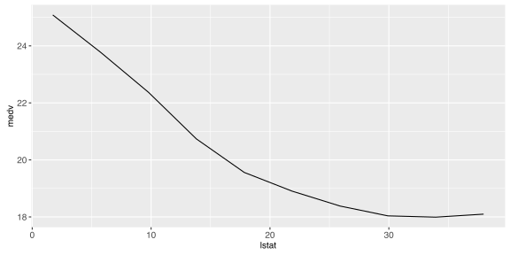

With a classification task, a line is drawn for each class, which gives the estimated partial
probability of that class for a particular point in the feature grid.


plotPartialDependence(pd.classif)


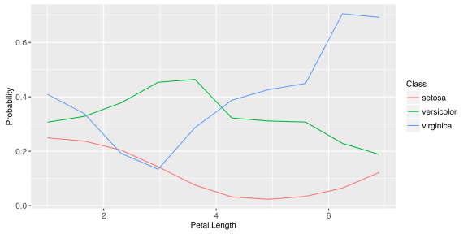

For regression tasks, when the `fun` argument of [generatePartialDependenceData](https://github.com/mlr-org/mlr/blob/master/R/generatePartialDependence.R) is used,
the bounds will automatically be displayed using a gray ribbon.


plotPartialDependence(pd.ci)


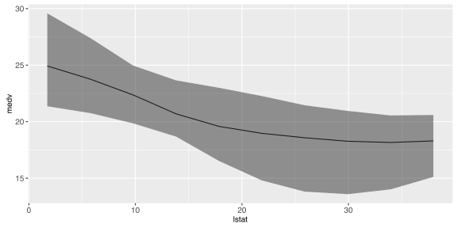

The same goes for plots of partial dependences where the learner has `predict.type = "se"`.


plotPartialDependence(pd.se)


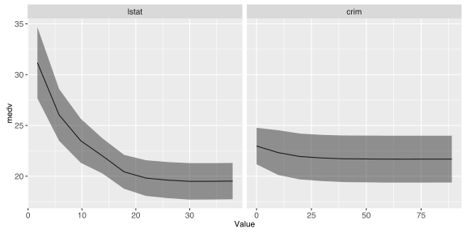

When multiple features are passed to [generatePartialDependenceData](https://github.com/mlr-org/mlr/blob/master/R/generatePartialDependence.R) but `interaction = FALSE`,
facetting is used to display each estimated bivariate relationship.


plotPartialDependence(pd.lst)


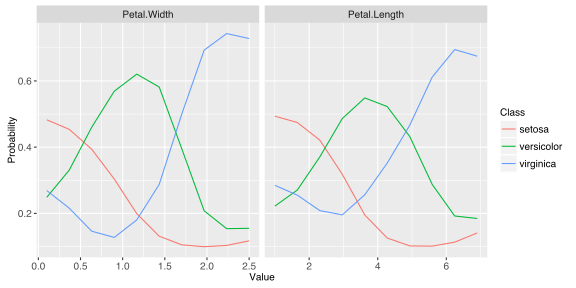

When `interaction = TRUE` in the call to [generatePartialDependenceData](https://github.com/mlr-org/mlr/blob/master/R/generatePartialDependence.R), one variable must
be chosen to be used for facetting, and a subplot for each value in the chosen feature's grid
is created, wherein the other feature's partial dependences within the facetting feature's
value are shown. Note that this type of plot is limited to two features.


plotPartialDependence(pd.int, facet = "Petal.Length")


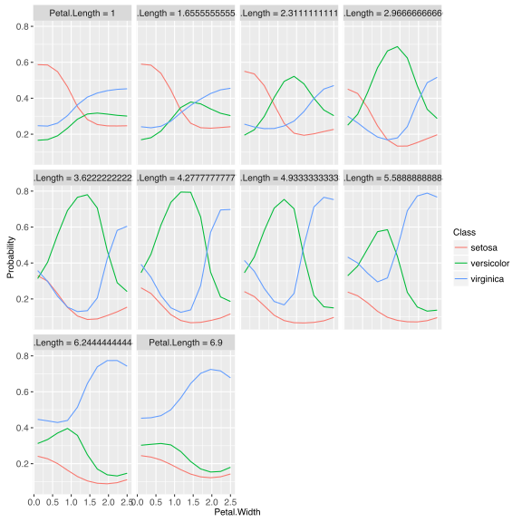

When `individual = TRUE` each individual conditional expectation curve is plotted.


plotPartialDependence(pd.ind.regr)


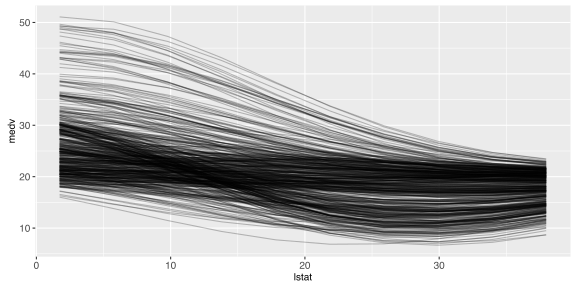

When the individual curves are centered by subtracting the individual conditional expectations
estimated at a particular value of $X_s$ this results in a fixed intercept which aids in
visualizing variation in predictions made by $\hat{f}^{(i)}_{x_s}$.


plotPartialDependence(pd.ind.classif)


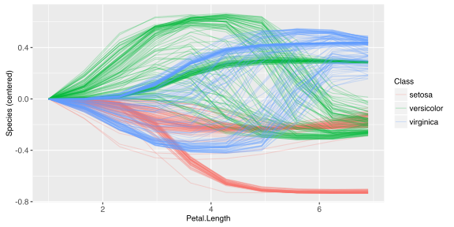

Plotting partial derivative functions works the same as partial dependence. Below are estimates
of the derivative of the mean aggregated partial dependence function, and the individual
partial dependence functions for a regression and a classification task respectively.


plotPartialDependence(pd.regr.der)


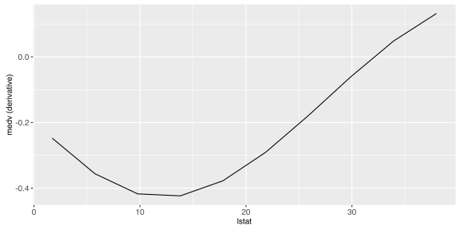

This suggests that $\hat{f}$ is not additive in `lstat` except in the neighborhood of $25$.


plotPartialDependence(pd.regr.der.ind)


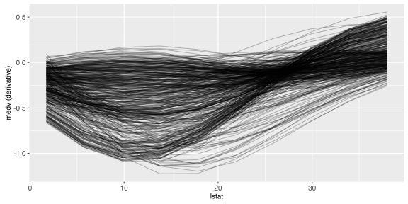

This suggests that `Petal.Width` interacts with some other feature in the neighborhood of
$(1.5, 2)$ for classes "virginica" and "versicolor".


plotPartialDependence(pd.classif.der.ind)


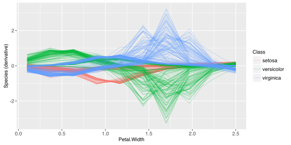
