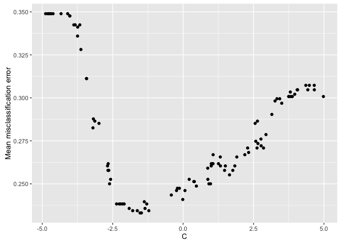
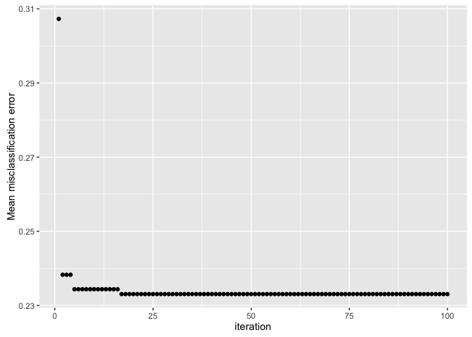
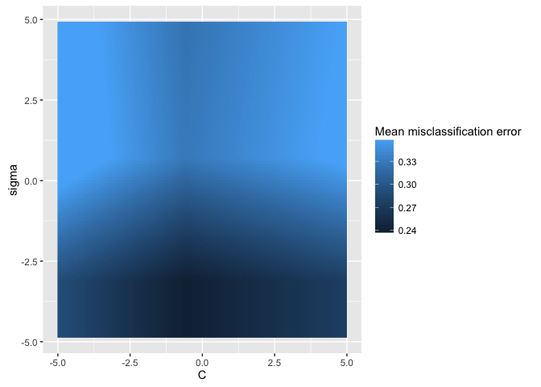
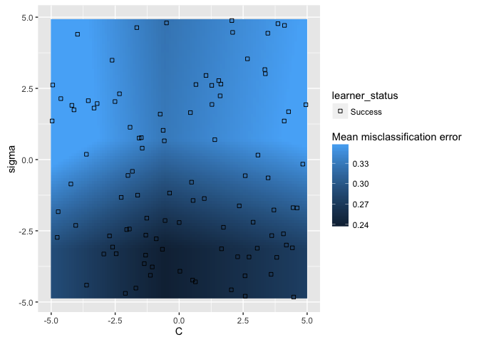
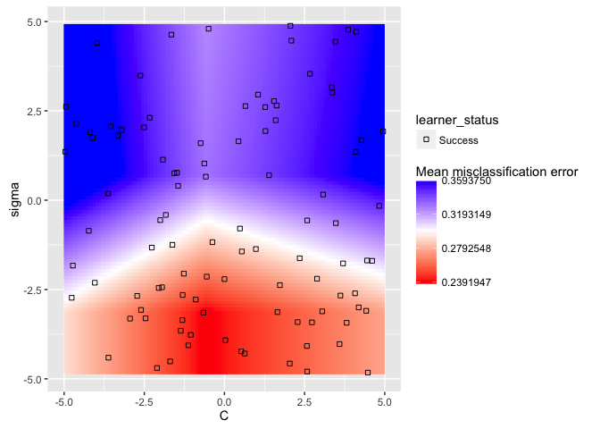

Learners use hyperparameters to achieve better performance on particular 
datasets. When we use a machine learning package to choose the best hyperparmeters,
the relationship between changing the hyperparameter and performance might not 
be obvious. [mlr](http://github.com/mlr-org/mlr) provides several new 
implementations to better understand what happens when we tune hyperparameters 
and to help us optimize our choice of hyperparameters.

<!--more-->

# Background

Let's say you have a dataset, and you're getting ready to flex your machine 
learning muscles. Maybe you want to do classification, or regression, or 
clustering. You get your dataset together and pick a few learners to evaluate. 

The majority of learners that you might use for any of these tasks 
have hyperparameters that the user must tune. Hyperparameters may be able to take 
on a lot of possible values, so it's typically left to the user to specify the 
values. If you're using a popular machine learning library like [sci-kit learn](http://scikit-learn.org/stable/), 
the library will take care of this for you via cross-validation: auto-generating 
the optimal values for your hyperparameters. We'll then take these best-performing 
hyperparameters and use those values for our learner. Essentially, we treat the 
optimization of hyperparameters as a black box. 

In [mlr](http://github.com/mlr-org/mlr), we want to open up that black box, so 
that you can make better decisions. Using the functionality built-in, we can 
answer questions like:

- How does varying the value of a hyperparameter change the performance of the machine learning algorithm?
- On a related note: where's an ideal range to search for optimal hyperparameters?
- How did the optimization algorithm (prematurely) converge?
- What's the relative importance of each hyperparameter?

Some of the users who might see benefit from "opening" the black box of hyperparameter 
optimization:

- researchers that want to better understand learners in practice
- engineers that want to maximize performance or minimize run time
- teachers that want to demonstrate what happens when tuning hyperparameters

We'll use [Pima Indians](https://archive.ics.uci.edu/ml/datasets/Pima+Indians+Diabetes) dataset in this blog post, where we want to 
predict whether or not someone has diabetes, so we'll perform classification, 
but the methods we discuss also work for regression and clustering.

Perhaps we decide we want to try [kernlab's svm](http://www.rdocumentation.org/packages/kernlab/versions/0.9-24) for our 
classification task. Knowing that svm has several hyperparameters to tune, we 
can ask mlr to list the hyperparameters to refresh our memory:


library(mlr)
# to make sure our results are replicable we set the seed
set.seed(7)
getParamSet("classif.ksvm")



##                        Type  len    Def
## scaled              logical    -   TRUE
## type               discrete    -  C-svc
## kernel             discrete    - rbfdot
## C                   numeric    -      1
## nu                  numeric    -    0.2
## epsilon             numeric    -    0.1
## sigma               numeric    -      -
## degree              integer    -      3
## scale               numeric    -      1
## offset              numeric    -      1
## order               integer    -      1
## tol                 numeric    -  0.001
## shrinking           logical    -   TRUE
## class.weights numericvector <NA>      -
## fit                 logical    -   TRUE
## cache               integer    -     40
##                                                 Constr Req Tunable Trafo
## scaled                                               -   -    TRUE     -
## type              C-svc,nu-svc,C-bsvc,spoc-svc,kbb-svc   -    TRUE     -
## kernel        vanilladot,polydot,rbfdot,tanhdot,lap...   -    TRUE     -
## C                                             0 to Inf   Y    TRUE     -
## nu                                            0 to Inf   Y    TRUE     -
## epsilon                                    -Inf to Inf   Y    TRUE     -
## sigma                                         0 to Inf   Y    TRUE     -
## degree                                        1 to Inf   Y    TRUE     -
## scale                                         0 to Inf   Y    TRUE     -
## offset                                     -Inf to Inf   Y    TRUE     -
## order                                      -Inf to Inf   Y    TRUE     -
## tol                                           0 to Inf   -    TRUE     -
## shrinking                                            -   -    TRUE     -
## class.weights                                 0 to Inf   -    TRUE     -
## fit                                                  -   -    TRUE     -
## cache                                         1 to Inf   -   FALSE     -


Noting that we have default values for each of the hyperparameters, we could 
simply accept the defaults for each of the hyperparameters and evaluate our 
`mmce` performance using 3-fold cross validation:


rdesc = makeResampleDesc("CV", iters = 3)
r = resample("classif.ksvm", pid.task, rdesc)
print(r)



## Resample Result
## Task: PimaIndiansDiabetes-example
## Learner: classif.ksvm
## mmce.aggr: 0.24
## mmce.mean: 0.24
## mmce.sd: 0.03
## Runtime: 0.104749


While this result may seem decent, we have a nagging doubt: what if we chose 
hyperparameter values different from the defaults? Would we get better results?

Maybe we believe that the default of `kernel = "rbfdot"` will work well based 
on our prior knowledge of the dataset, but we want to try altering our 
regularization to get better performance. For [kernlab's svm](http://www.rdocumentation.org/packages/kernlab/versions/0.9-24), regularization 
is represented using the `C` hyperparameter. Calling `getParamSet` again to 
refresh our memory, we see that `C` defaults to 1.


getParamSet("classif.ksvm")



##                        Type  len    Def
## scaled              logical    -   TRUE
## type               discrete    -  C-svc
## kernel             discrete    - rbfdot
## C                   numeric    -      1
## nu                  numeric    -    0.2
## epsilon             numeric    -    0.1
## sigma               numeric    -      -
## degree              integer    -      3
## scale               numeric    -      1
## offset              numeric    -      1
## order               integer    -      1
## tol                 numeric    -  0.001
## shrinking           logical    -   TRUE
## class.weights numericvector <NA>      -
## fit                 logical    -   TRUE
## cache               integer    -     40
##                                                 Constr Req Tunable Trafo
## scaled                                               -   -    TRUE     -
## type              C-svc,nu-svc,C-bsvc,spoc-svc,kbb-svc   -    TRUE     -
## kernel        vanilladot,polydot,rbfdot,tanhdot,lap...   -    TRUE     -
## C                                             0 to Inf   Y    TRUE     -
## nu                                            0 to Inf   Y    TRUE     -
## epsilon                                    -Inf to Inf   Y    TRUE     -
## sigma                                         0 to Inf   Y    TRUE     -
## degree                                        1 to Inf   Y    TRUE     -
## scale                                         0 to Inf   Y    TRUE     -
## offset                                     -Inf to Inf   Y    TRUE     -
## order                                      -Inf to Inf   Y    TRUE     -
## tol                                           0 to Inf   -    TRUE     -
## shrinking                                            -   -    TRUE     -
## class.weights                                 0 to Inf   -    TRUE     -
## fit                                                  -   -    TRUE     -
## cache                                         1 to Inf   -   FALSE     -


Let's tell [mlr](http://github.com/mlr-org/mlr) to randomly pick `C` values 
between `2^-5` and `2^5`, evaluating `mmce` using 3-fold cross validation:


# create the C parameter in continuous space: 2^-5 : 2^5
ps = makeParamSet(
  makeNumericParam("C", lower = -5, upper = 5, trafo = function(x) 2^x)
)
# random search in the space with 100 iterations
ctrl = makeTuneControlRandom(maxit = 100L)
# 3-fold CV
rdesc = makeResampleDesc("CV", iters = 2L)
# run the hyperparameter tuning process
res = tuneParams("classif.ksvm", task = pid.task, control = ctrl, 
  resampling = rdesc, par.set = ps, show.info = FALSE)
print(res)



## Tune result:
## Op. pars: C=0.347
## mmce.test.mean=0.233


[mlr](http://github.com/mlr-org/mlr) gives us the best performing value for `C`, 
and we can see that we've improved our results vs. just accepting the default 
value for `C`. This functionality is available in other machine learning packages, like 
sci-kit learn's [random search](http://scikit-learn.org/stable/modules/generated/sklearn.grid_search.RandomizedSearchCV.html), but this functionality is essentially treating our
choice of `C` as a black box method: we give a search strategy and just accept 
the optimal value. What if we wanted to get a sense of the relationship between 
`C` and `mmce`? Maybe the relationship is linear in a certain range and we can 
exploit this to get better even performance! [mlr](http://github.com/mlr-org/mlr) 
provides 2 methods to help answer this question: `generateHyperParsEffectData` to 
generate the resulting data and `plotHyperParsEffect` providing many options 
built-in for the user to plot the data. 

Let's investigate the results from before where we tuned `C`:


data = generateHyperParsEffectData(res)
plotHyperParsEffect(data, x = "C", y = "mmce.test.mean")


From the scatterplot, it appears our optimal performance is somewhere in the 
region between `2^-2.5` and `2^-1.75`. This could provide us a region to further 
explore if we wanted to try to get even better performance!

We could also evaluate how "long" it takes us to find that optimal value:


plotHyperParsEffect(data, x = "iteration", y = "mmce.test.mean")


By default, the plot only shows the global optimum, so we can see that we found 
the "best" performance in less than 25 iterations!

But wait, I hear you saying. I also want to tune `sigma`, the inverse kernel 
width of the radial basis kernel function. So now we have 2 hyperparameters that 
we want to simultaneously tune: `C` and `sigma`. 


# create the C and sigma parameter in continuous space: 2^-5 : 2^5
ps = makeParamSet(
  makeNumericParam("C", lower = -5, upper = 5, trafo = function(x) 2^x),
  makeNumericParam("sigma", lower = -5, upper = 5, trafo = function(x) 2^x)
)
# random search in the space with 100 iterations
ctrl = makeTuneControlRandom(maxit = 100L)
# 3-fold CV
rdesc = makeResampleDesc("CV", iters = 2L)
# run the hyperparameter tuning process
res = tuneParams("classif.ksvm", task = pid.task, control = ctrl, 
  resampling = rdesc, par.set = ps, show.info = FALSE)
print(res)



## Tune result:
## Op. pars: C=0.233; sigma=0.0386
## mmce.test.mean=0.232



# collect the hyperparameter data
data = generateHyperParsEffectData(res)


We can use `plotHyperParsEffect` to easily create a heatmap with both hyperparameters. 
We get tons of functionality for free here. For example, [mlr](http://github.com/mlr-org/mlr) 
will automatically interpolate the grid to get an estimate for values we didn't 
even test! All we need to do is pass a regression learner to the `interpolate` 
argument:


plotHyperParsEffect(data, x = "C", y = "sigma", z = "mmce.test.mean",
  plot.type = "heatmap", interpolate = "regr.earth")


If we use the `show.experiments` argument, we can see which points were 
actually tested and which were interpolated:


plotHyperParsEffect(data, x = "C", y = "sigma", z = "mmce.test.mean",
  plot.type = "heatmap", interpolate = "regr.earth", show.experiments = TRUE)


`plotHyperParsEffect` returns a `ggplot2` object, so we can always customize it 
to better fit our needs downstream:


plt = plotHyperParsEffect(data, x = "C", y = "sigma", z = "mmce.test.mean",
  plot.type = "heatmap", interpolate = "regr.earth", show.experiments = TRUE)
min_plt = min(plt$data$mmce.test.mean, na.rm = TRUE)
max_plt = max(plt$data$mmce.test.mean, na.rm = TRUE)
mean_plt = mean(c(min_plt, max_plt))
plt + scale_fill_gradient2(breaks = seq(min_plt, max_plt, length.out = 4),
  low = "red", mid = "white", high = "blue", midpoint = mean_plt)


Now we can get a good sense of where the separation happens for each of the 
hyperparameters: in this particular example, we want lower values for `sigma` 
and values around 1 for `C`.

This was just a taste of mlr's hyperparameter tuning visualization capabilities. For the full tutorial, check out the [mlr tutorial](http://mlr-org.github.io/mlr-tutorial/devel/html/hyperpar_tuning_effects/index.html).

Some features coming soon:

- "Prettier" plot defaults
- Support for more than 2 hyperparameters
- Direct support for hyperparameter "importance"

Thanks to the generous sponsorship from [GSoC](https://summerofcode.withgoogle.com/), and many thanks to my mentors Bernd Bischl and Lars Kotthoff!
