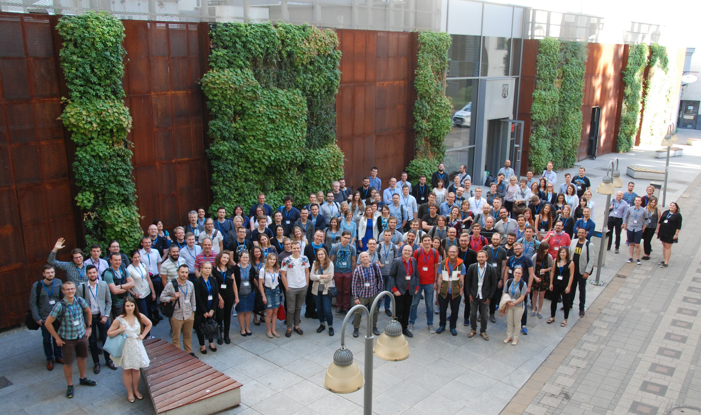

This July we had the great honor to present mlr and its ecosystem at the [Why R 2018 Conference](http://whyr2018.pl/) in Wroclaw in Poland.
You can find the slides [here](https://github.com/mlr-org/mlr-outreach).
We want to thank the organizers for inviting us, providing us with great food and coffee and also many thanks to all participants for showing great interest in mlr.

<!--more-->
We had the chance to present the basics of mlr to a large audience during the beginners mlr workshop. Janek und Daniel held the presentation, which you can find [here](https://github.com/mlr-org/mlr-outreach/blob/master/2018_07_wroclaw/whyr_beginner_workshop_mlr.pdf).
In parallel to the beginners workshop, we also held an advanced workshop. Bernd presented more advanced topics like [hyperparameter tuning](http://mlr-org.github.io/mlr/articles/tutorial/devel/tune.html), [nested resampling](http://mlr-org.github.io/mlr/articles/tutorial/devel/nested_resampling.html), and [CPOs](https://github.com/mlr-org/mlrCPO) [[slides](https://github.com/mlr-org/mlr-outreach/blob/master/2018_07_wroclaw/mlr_adv1.pdf)], Jakob presented [bayesian optimization in mlr](https://github.com/mlr-org/mlrMBO) [[slides](https://github.com/mlr-org/mlr-outreach/blob/master/2018_07_wroclaw/mlrMBO_tutorial.pdf)], and Giuseppe gave an introduction to [OpenML](https://www.openml.org/) [[slides](https://github.com/mlr-org/mlr-outreach/raw/master/2018_07_wroclaw/whyR2018_openml_tutorial/slides_tutorial.html), right click, 'save as']. 

During a great talk session we had the chance to present the mlr ecosystem.
Florian's talk was about functional data analysis in mlr [[slides](https://github.com/mlr-org/mlr-outreach/blob/master/2018_07_wroclaw/mlr_functional_data.pdf)].
Janek held a talk about optimising deep neural networks with mlr, also discussing the pros and cons of doing deep learning in R [[slides](https://github.com/mlr-org/mlr-outreach/blob/master/2018_07_wroclaw/deeplearning_in_mlr.html/)].
The next talk about a general introduction to interpretable machine learning was from Christoph [[slides](https://github.com/mlr-org/mlr-outreach/blob/master/2018_07_wroclaw/mlr_iml.pdf)].
Following, Quay presented how to do multilabel classification in mlr [[slides](https://github.com/mlr-org/mlr-outreach/blob/master/2018_07_wroclaw/mlr_multilabel.pdf)].
And finally, Xudong gave an introduction to his [rlR](https://github.com/smilesun/rlR) package for reinforcement learning in R [[slides](https://github.com/mlr-org/mlr-outreach/blob/master/2018_07_wroclaw/rlR_wroclaw.pdf)].

The conference really encouraged us to work harder, in order to create even better software.
We also hope the event created interest in participating and contributing to mlr, as the community really thrives on knowledge and experience of a very diverse set of people and backgrounds. 

