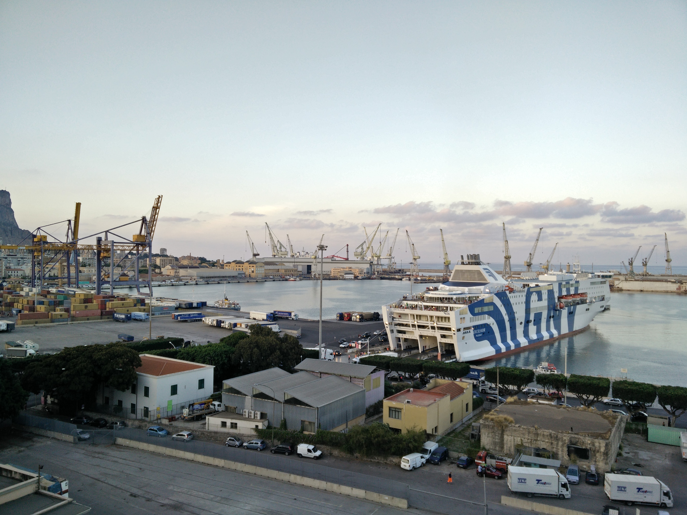
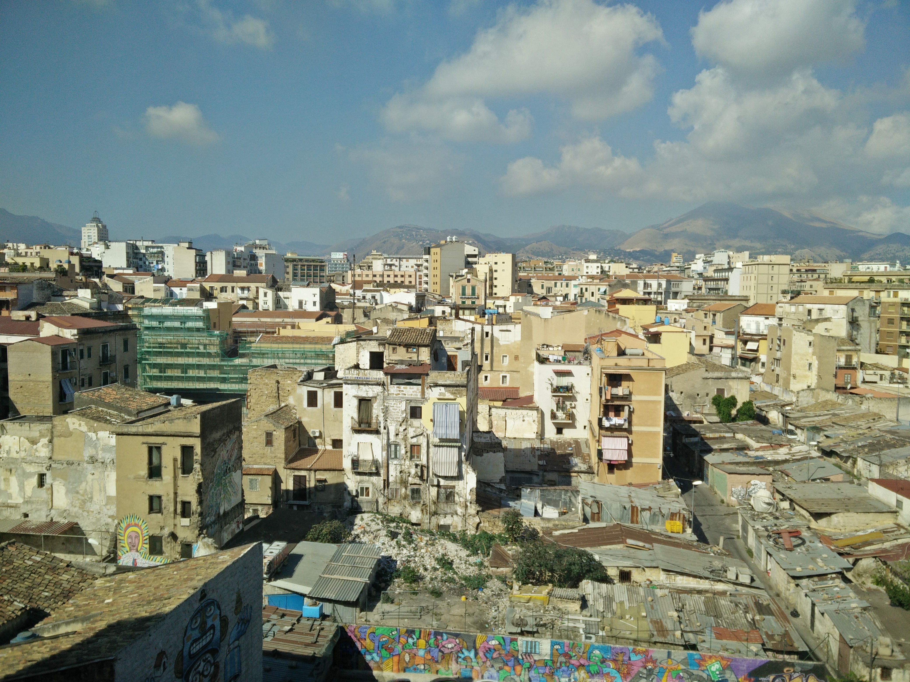
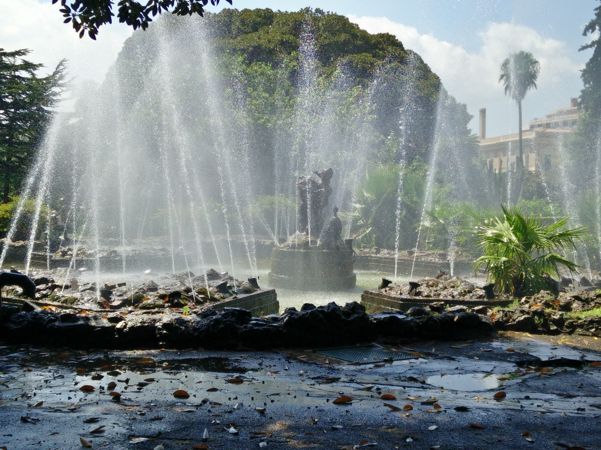

## The mlr workshop

The mlr developer team is quite international: Germany, USA, Canada. The time difference between these countries sometimes makes it hard to communicate and develop new features.

The idea for this workshop or [sprint](https://en.wikipedia.org/wiki/Sprint_(software_development) was to have the possibility to talk about the project status, future and structure, exterminate imperishable bugs and start to developing some fancy features.

Since we wanted to meet at a nice place we decided to go to Palermo, where the [department of statistics](https://www.unipa.it/dipartimenti/seas/) provided us with a room in the university for the workshop.

Twelve people from the developer team met from the 8. to 15. August to work on and with mlr.

## Result of the workhop

We could close a lot of issues and develop new features so that we will release version 2.10 of mlr in the next few days.

We also head a great time in a great city aside from the workhop, here are some impressions:

